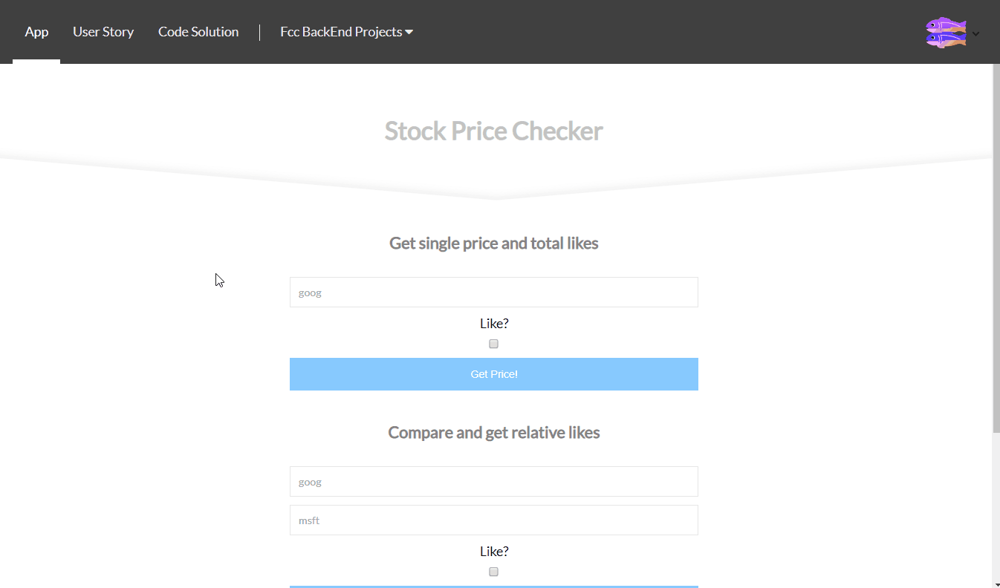

# Stock price checker
### About the project

it's a freecodecamp project in the "Information Security and Quality Assurance Projects" module, you have to build an API that will receive a stock name and return a json containing the stock informations.

bonus*: 
- Front-end using React
- Validation using Joi

### Tools used

**Front-end:** React

**Back-end:** Express, Helmet

**Database:** Mongodb

**Test:** Mocha, Chai

### Screenshot

### Link

https://fcc-bt-stock-price-checker.glitch.me

### User stories

1. Set the content security policies to only allow loading of scripts and css from your server.
2. I can GET `/api/stock-prices` with form data containing a Nasdaq stock ticker and recieve back an object `stockData`.
3. In `stockData`, I can see the `stock`(string, the ticker), `price`(decimal in string format), and `likes`(int).
4. I can also pass along field `like` as true(boolean) to have my like added to the stock(s). Only 1 like per ip should be accepted.
5. If I pass along 2 stocks, the return object will be an array with both stock's info but instead of likes, it will display `rel_likes`(the difference between the likes on both) on both.
6. All 5 functional tests are complete and passing.
